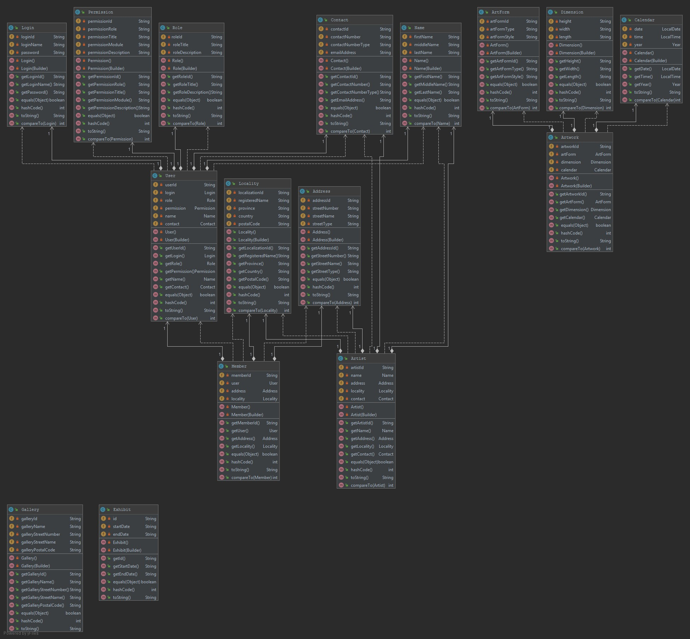
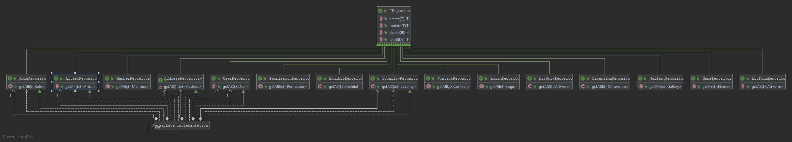

## <u>**ArtDomain**</u>

The program is an online portal for artists to showcase their work, arrange exhibitions, arrange purchasing and sales of artwork, etc.

I will be creating a program that allows up and coming artists to showcase there work online. 

1. Arrange exhibitions by uploading details of events for site visitors to have access to. 

2. They will have the option to arrange sales with potential customers by transferring purchase/sale details between buyer and seller. 

   The application will not have the ability to handle actual transactions as this is outside of the scope of my current capabilities.

3. The member and buyer can also arrange for the product details to be made available for a courier company to pick up. 

The focus of the application is transfer of information and not actual monetary transactions.

#### <u>Below is a list of possible classes:</u>

------

01. Address
02. ArtForm
03. Artist
03. Artwork
04. Calendar
05. Contact
06  Dimension
07. Exhibit
08. Gallery
09. Locality
10. Login
11. Member
12. Name
13. Permission
14. Role
15. User
16. Misc

------

#### <u>Please see UML Class Diagram below:</u>

